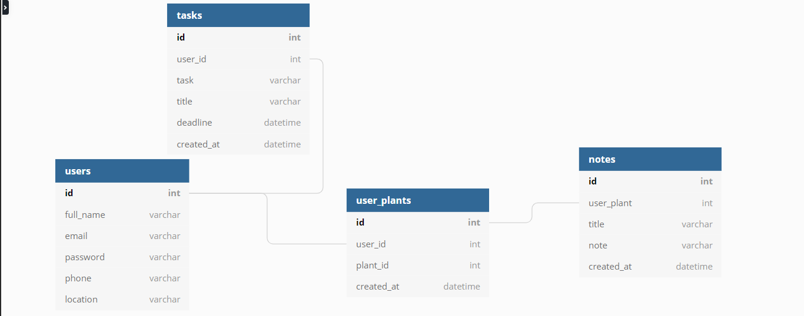

# Database

## Table Diagram


## Models

### Users

```
{
    full_name: string, *REQUIRED*
    email: string,     *REQUIRED*
    password: string,  *REQUIRED*
    phone: string,     *OPTIONAL*
    location: string   *OPTIONAL*
}
```

### User Plants

```
{
    user_id: int,         *REQUIRED*
    plant_id: int,        *REQUIRED*
    created_at: datetime  *REQUIRED*
}
```

### Tasks

```
{
    user_id: int,         *REQUIRED*
    title: string,        *REQUIRED*
    task: string,         *REQUIRED*
    deadline: datetime,   *REQUIRED*
    created_at: datetime  *REQUIRED*
}
```

### Notes

```
{
    plant_id: int,         *REQUIRED*
    title: string,         *REQUIRED*
    note: string,          *REQUIRED*
    created_at: datetime,  *REQUIRED*
}
```
# Endpoints

## Users

| Request Type | Endpoint                       | Description             |
|:------------:|:------------------------------:|:-----------------------:|
| POST         | /api/register                  | Creates User            |
| POST         | /api/login                     | Creates JWT             |
| GET          | /api/users                     | Returns All Users       |
| GET          | /api/users/:id                 | Returns User By ID      |
| PUT          | /api/users/:id                 | Update User             |
| DELETE       | /api/users/:id                 | Remove User             |

## User Plants
| Request Type | Endpoint                       | Description             |
|:------------:|:------------------------------:|:-----------------------:|
| GET          | api/users/:id/plants           | Get All User Plants     |
| GET          | api/users/:id/plants/:plant_id | Get Specific User Plant |
| POST         | api/users/:id/plants           | Add User Plant          |
| PUT          | api/users/:id/plants/:plant_id | Update User Plant       |
| DELETE       | api/users/:id/plants/:plant_id | Remove User Plant       |

## Tasks
| Request Type | Endpoint                       | Description             |
|:------------:|:------------------------------:|:-----------------------:|
| GET          | api/users/:id/tasks            | Get All User Tasks      |
| GET          | api/users/:id/tasks/:task_id   | Get Specific User Task  |
| POST         | api/users/:id/tasks            | Add User Task           |
| PUT          | api/users/:id/tasks/:task_id   | Update User Task        |
| DELETE       | api/users/:id/tasks/:task_id   | Remove User Task        |

## Notes
| Request Type | Endpoint                       | Description             |
|:------------:|:------------------------------:|:-----------------------:|
| GET          | api/notes/:plant_id            | Get All Notes For Plant |
| GET          | api/notes/:plant_id/:note_id   | Get Specific Plant Note |
| POST         | api/notes/:plant_id            | Add Note For Plant      |
| PUT          | api/notes/:plant_id/:note_id   | Update Note Information |
| DELETE       | api/notes/:plant_id/:note_id   | Remove Plant Note       |

# API

## Auth Routes:

### POST
`/api/register`

- Expects Following Shape

```
{
    full_name: string, *REQUIRED*
    email: string,     *REQUIRED*
    password: string,  *REQUIRED*
    phone: string,     *OPTIONAL*
    location: string   *OPTIONAL*
}
```

`/api/login`

- Expects Following Shape

```
{
    email: string,   *REQUIRED*
    password: string *REQUIRED*
}
```

## User Routes

### GET

`api/users`

- Returns All Users In Database

`api/users/:id`

- Returns User That Matches ID

### PUT

`api/users/:id`

- Updates User Information

- Expects Following Shape, Only One Field Required

```
{
    full_name: string, *OPTIONAL*
    email: string,     *OPTIONAL*
    password: string,  *OPTIONAL*
    phone: string,     *OPTIONAL*
    location: string   *OPTIONAL*
}
```

### Delete

`api/users/:id`

- Removes User From Database That Matches ID

## User Plant Routes

### GET

`api/users/:id/plants`

- Returns All The Plants Stored By User With Matching ID

`api/users/:id/plants/:plant_id`

- Returns A Specific Plant That Matchs The `plant_id` For The User That Matches `id`

### POST

`api/users/:id`

- Expects The Following Shape
- Field `user_id` should be set to `id` from URL
- Field `plant_id` should match ID set by third-party API

```
{
    user_id: int,         *REQUIRED*
    plant_id: int,        *REQUIRED*
}
```

### DELETE

`api/users/:id/plants/:plant_id`

- Removed Plant That Matches `plant_id` By User That Matches `id`

## Task Routes

### GET

`api/users/:id/tasks`

- Returns All Tasks That Matches User By `id`

`api/users/:id/tasks/:task_id`

- Returns A Specific Task That Matches `task_id` By User that Matches `id`

### POST

`api/users/:id/tasks`

- Expects The Following Shape
- Field `user_id` Should Match `id`

```
{
    user_id: int,         *REQUIRED*
    title: string,        *REQUIRED*
    task: string,         *REQUIRED*
    deadline: datetime,   *REQUIRED*
}
```

### PUT

`api/users/:id/tasks/:task_id`

- Updates Task Information
- Expects Following Shape
- Only One Field Required Per Request

```
{
    user_id: int,         *OPTIONAL*
    title: string,        *OPTIONAL*
    task: string,         *OPTIONAL*
    deadline: datetime,   *OPTIONAL*
}
```

### DELETE

`api/users/:id/tasks/:task_id`

- Removed Task That Matches `task_id` By User That Matches `id`

## Note Routes

### GET

`api/notes/:plant_id`

- Returns All Notes Associated With The Plant That Matches `plant_id`

`api/notes/:plant_id/:note_id`

- Returns A Note That Matches `noted_id` By The Plant That Matches `plant_id`

### POST

`api/notes/:plant_id`

- Adds A Note To The Plant That Matches `plant_id`
- Field `plant_id` Should Match `plant_id`
- Expects The Follwowing Shape

```
{
    plant_id: int,         *REQUIRED*
    title: string,         *REQUIRED*
    note: string,          *REQUIRED*
}
```

### PUT

`api/notes/:plant_id/:note_id`

- Updates Note Information That Matches `noted_id` By Plant That Matches `plant_id`

- Expects Following Shape, Only One Field Required Per Request

```
{
    plant_id: int,         *OPTIONAL*
    title: string,         *OPTIONAL*
    note: string,          *OPTIONAL*
}
```

### DELETE

`api/notes/:plant_id/:note_id`

- Removes The Note That Matches `note_id` By The Plant That Matches `plant_id` From The Database